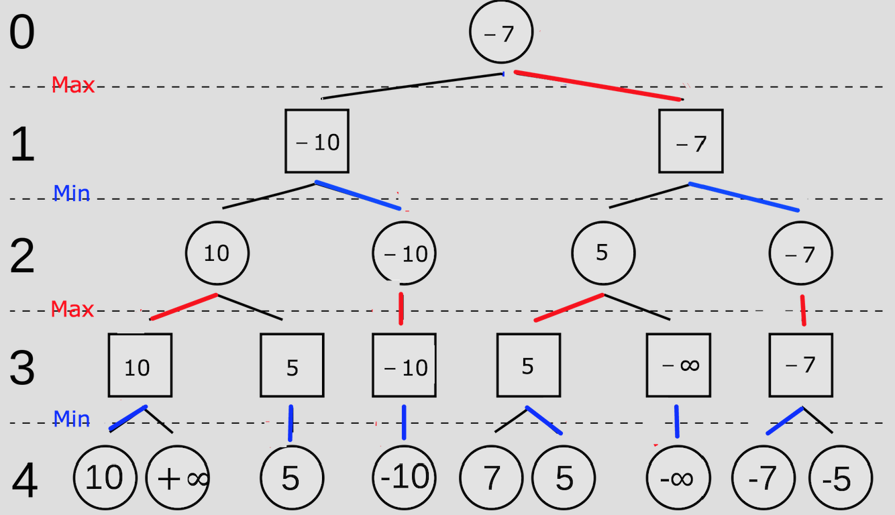

# 实验报告

## 概述

- **第一阶段**：基于**Alpha-Beta剪枝算法**
- **第二阶段**：基于**AlphaZero**，尝试简单复现

## 基于 Alpha-Beta 剪枝的传统算法实现

### 1.1 环境

- **语言**：Python3
- **库**：Pygame


### 1.2 算法概述

#### 1.2.1 基于极大极小值算法（Minimax）

核心思想是构建博弈树，假设双方均采用最优策略：MAX层（己方）总是选择能使局面评分最大的走法，而 MIN层（对方）总是选择能使局面评分最小的走法。

博弈树的数值是针对己方而言的，因此在评分函数中己方取正值，对手取负值。

搜索四步以后所有情况：




**最后更新得到分数最优走法**

#### 1.2.2 Alpha-Beta 剪枝优化

为了解决 Minimax 算法在搜索深度增加时计算量呈指数级爆炸的问题，引入 Alpha-Beta 剪枝。该算法维护两个极值边界：

- **Alpha（α）**：MAX 节点当前搜索到的最佳选择（下界）。
- **Beta（β）**：MIN 节点当前搜索到的最佳选择（上界）。

**剪枝逻辑**：

- **α 剪枝**：在 MIN 节点，若发现某分支的值 $value \leq \alpha$，则该节点及其后续分支无需继续搜索（MAX 层不会选择进入该 MIN 节点）。
- **β 剪枝**：在 MAX 节点，若发现某分支的值 $value \geq \beta$，则该节点及其后续分支无需继续搜索（MIN 层不会允许该局面出现）。

例如下图

圆形代表己方，方形代表对手


从左向右：

第一次剪枝是因为在 MIN 节点发现当前分支通过子节点更新的值小于父节点传下来的 $\alpha$，因此父节点一定不会选择这个子节点。

第二次剪枝是因为在 MAX 节点发现当前分支通过子节点更新的值大于父节点传下来的 $\beta$，因此父节点一定不会选择这个子节点。

同理第三次和第四次

### 1.3 实验实现与分析

#### 1.3.0 数据结构

使用二维数组

```python
BOARD_SIZE = 15
# ...
board = [[EMPTY for _ in range(BOARD_SIZE)] for _ in range(BOARD_SIZE)]
```

- `EMPTY` (`0`): 空位
- `BLACK_STONE` (`1`): 黑子
- `WHITE_STONE` (`2`): 白子

使用 `board[row][col]` 的形式访问

#### 1.3.1 核心搜索算法实现

代码逻辑如下：

```python
def minimax(board, depth, alpha, beta, maximizing_player, current_player, original_player):
    # 递归终止条件：达到指定深度或游戏结束
    if depth == 0:
        return evaluate(board, original_player)

    possible_moves = get_possible_moves(board)
    if not possible_moves:
        return evaluate(board, original_player)

    opponent = BLACK_STONE if current_player == WHITE_STONE else WHITE_STONE

    if maximizing_player:
        max_eval = -float('inf')
        for move in possible_moves:
            i, j = move
            board[i][j] = current_player
            # 递归调用
            eval_score = minimax(board, depth - 1, alpha, beta, False, opponent, original_player)
            board[i][j] = EMPTY  # 回溯状态
            
            max_eval = max(max_eval, eval_score)
            alpha = max(alpha, eval_score)
            # 执行 β 剪枝
            if beta <= alpha:
                break 
        return max_eval

    else:
        min_eval = float('inf')
        for move in possible_moves:
            i, j = move
            board[i][j] = current_player
            eval_score = minimax(board, depth - 1, alpha, beta, True, opponent, original_player)
            board[i][j] = EMPTY  # 回溯状态
            
            min_eval = min(min_eval, eval_score)
            beta = min(beta, eval_score)
            # 执行 α 剪枝
            if beta <= alpha:
                break 
        return min_eval
```

#### 1.3.2 评估函数

将棋盘局势转化为数值，决定决策质量。

##### 1.3.2.1 基于人工特征权重的设计

基于规则的评分系统，通过识别特定的棋型（如连五、活四、冲四等）并赋予相应权重来计算局势分。

```python
def evaluate(board, player):
    # 棋型权重常量定义
    W_FIVE = 100000      # 连五：必胜
    W_FOUR_OPEN = 10000  # 活四：极高威胁
    W_FOUR_HALF = 2500   # 冲四
    W_THREE_OPEN = 1500  # 活三
    # ... 其他权重及位置评分
    # 综合计算当前玩家得分 - 对手得分
```

##### 1.3.2.2 不足

1. 需要穷举所有可能的棋型组合
2. 权重的微小调整会导致 AI 行为的剧烈变化（如过于激进或过于保守），且难以通过手动调参找到全局最优解。
3. 该方法本质上是专家系统，其能力上限受限于设计者的五子棋水平，无法应对未预设的复杂局面。

### 1.3 第一阶段总结

#### 1.3.1 实验成果

1. 成功实现了基于 Alpha-Beta 剪枝的博弈树搜索算法。
2. 构建了基础的棋型评估系统，AI 具备了初级的攻防能力。

#### 1.3.2 局限

传统方法的局限性在于其**非学习性**。AI 无法从失败中总结经验，也无法根据对手的风格动态调整策略。这种依赖人工先验知识的方法并不符合我们对“智能”的定义。

---

## 基于 AlphaZero 的深度强化学习实现

### 2.0 环境

- **语言**：Python 3
- **库**：PyTorch, NumPy, Pygame

### 2.1 概述

依赖人工先验知识的方法并不符合我们对“智能”的定义，因此第二阶段尝试简单复现 AlphaZero 算法。该算法不使用人工估值函数，转而采用 CNN 来同时预测落子概率和局面价值，并通过自我对弈产生的数据进行强化学习训练。

### 2.2 核心算法架构设计

注：本部分代码逻辑参考了 AlphaZero 的[开源实现](https://github.com/junxiaosong/AlphaZero_Gomoku)

**说明：**

**由于硬件限制，将棋盘改为9x9，并且极大简化了神经网络设计**

#### 2.2.1 策略-价值网络

网络采用双头架构，共享底部的卷积层特征，提取棋盘的空间特征。

```python
class Net(nn.Module):
    """策略-价值网络模块"""
    def __init__(self, board_width, board_height):
        super(Net, self).__init__()

        # 公共骨干网络：特征提取
        # 输入维度：4 (特征平面) x 宽 x 高
        self.conv1 = nn.Conv2d(4, 32, kernel_size=3, padding=1)
        self.conv2 = nn.Conv2d(32, 64, kernel_size=3, padding=1)
        self.conv3 = nn.Conv2d(64, 128, kernel_size=3, padding=1)

        # 策略头：输出动作概率分布
        self.act_conv1 = nn.Conv2d(128, 4, kernel_size=1)
        self.act_fc1 = nn.Linear(4*board_width*board_height,
                                 board_width*board_height)

        # 价值头：输出当前局面胜率评估 [-1, 1]
        self.val_conv1 = nn.Conv2d(128, 2, kernel_size=1)
        self.val_fc1 = nn.Linear(2*board_width*board_height, 64)
        self.val_fc2 = nn.Linear(64, 1)
```

**输入特征设计**：采用 4 个二值化平面描述状态：

1. 当前玩家棋子分布
2. 对手棋子分布
3. 上一步落子位置（提供历史时序信息）
4. 当前执子方标识（1 为先手，0 为后手）

#### 2.2.2 蒙特卡洛树搜索（MCTS）

MCTS 是 AlphaZero 的决策引擎，它使用神经网络的输出来引导搜索方向。
每个节点存储四个关键统计量：

- $ N(s,a) $：访问次数
- $Q(s,a)$：平均动作价值
- $U(s,a)$：置信上界（探索项）
- $P(s,a)$：**先验概率（来自神经网络）**

**搜索流程**：

1. **选择**：依据 UCB 公式选择子节点，平衡“利用”（高 Q 值）与“探索”（高 P 值低 N 值）。
   $$
   U(s,a) = c_{puct} \cdot P(s,a) \cdot \frac{\sqrt{\sum_b N(s,b)}}{1 + N(s,a)}
   $$

2. **扩展**：到达叶节点后，调用神经网络计算 $(P, v)$，初始化所有合法动作的子节点。

3. **评估**：利用网络输出的 value $v$ 作为当前局面的评估值（不再进行随机模拟 Rollout）。

4. **回溯**：将评估值 $v$ 沿搜索路径反向传播，更新父节点的 $N$ 和 $Q$。

   节点最后的值为

$$
value = Q(s,a) + c_{puct} \cdot P(s,a) \cdot \frac{\sqrt{\sum_b N(s,b)}}{1 + N(s,a)}
$$

#### 2.2.3 自我对弈与数据生成

`./AlphaZero简单复现/mcts_alphaZero.py`

**关键策略**：

- **探索噪声**：在根节点添加 Dirichlet 噪声，防止自我对弈陷入单一策略的局部最优。

### 2.3 训练

#### 2.3.1 损失函数设计

训练目标是最小化联合损失函数：

$$
L = (z - v)^2 - \pi^T \log(p) + c \|\theta\|^2
$$

```python
def train_step(self, state_batch, mcts_probs, winner_batch, lr):
    # 1. 价值损失：网络预测值 v 逼近真实结果 z
    value_loss = F.mse_loss(value.view(-1), winner_batch)

    # 2. 策略损失：网络输出 p 逼近 MCTS 搜索概率 π
    policy_loss = -torch.mean(torch.sum(mcts_probs * log_act_probs, 1))

    # 3. 总损失
    loss = value_loss + policy_loss
    
    # 反向传播更新参数...
```

- MCTS 利用神经网络提供的先验概率 $P$ 进行搜索，产生更强的策略 $\pi$。
- 神经网络反过来以 $\pi$ 为目标进行训练，从而获得更准确的 $P$。

#### 2.3.2 训练流程控制

```python
def run(self):
    for i in range(self.game_batch_num):
        # 1. 收集自我对弈数据
        self.collect_selfplay_data(self.play_batch_size)

        # 2. 策略更新 (Experience Replay)
        if len(self.data_buffer) > self.batch_size:
            loss, entropy = self.policy_update()

        # 3. 模型评估与保存
        if (i+1) % self.check_freq == 0:
            # 让当前模型与纯 MCTS (基准) 对战
            win_ratio = self.policy_evaluate()
            
            # 仅在胜率提升时保存为最佳模型
            if win_ratio > self.best_win_ratio:
                self.best_win_ratio = win_ratio
                self.policy_value_net.save_model('./best_policy.model')
```

##### 自适应学习率策略：

引入了基于 KL 散度的动态调整机制。如果新旧策略差异过大（KL 值高），说明步长过大，需降低学习率；反之则增加学习率。这保证了策略更新的稳定性。

##### 调整评测

在胜率为100%时增加纯MCTS迭代次数

```python
if (self.best_win_ratio == 1.0 and
		self.pure_mcts_playout_num < 5000):
	self.pure_mcts_playout_num += 1000
	self.best_win_ratio = 0.0
```

##### 超参数

```python
        # 训练参数
        self.learn_rate = 2e-3
        self.lr_multiplier = 1.0  # 根据 KL 散度自适应调整学习率
        self.temp = 1.0  # 温度参数
        self.n_playout = 400  # 每次落子的模拟次数
        self.c_puct = 5
        self.buffer_size = 10000
        self.batch_size = 512  # 训练的 mini-batch 大小
        self.data_buffer = deque(maxlen=self.buffer_size)
        self.play_batch_size = 1
        self.epochs = 5  # 每次更新的训练步数
        self.kl_targ = 0.02
        self.check_freq = 50  # 每多少次对局检查一次性能
        self.game_batch_num = 1500 # 总训练对局数
        self.best_win_ratio = 0.0
        # 纯 MCTS 的模拟次数，作为评估基准
        self.pure_mcts_playout_num = 1000
```

在单张 NVIDIA GTX 1650 Laptop 上训练

训练日志见`./AlphaZero简单复现/training_log_20251217_232437.log`

### 2.4 第二阶段总结

#### 2.4.1 实验成果

1. 成功简化实现了 AlphaZero 的基本算法
2. 该算法体现不依赖先验知识，通过自我对弈强化学习展现出的**学习性**，对于任何棋类游戏的泛化性
3. 仅半天的训练时间在单张 NVIDIA GTX 1650 Laptop 实现了对4000次 MCTS 70% 左右的胜率

#### 2.4.2 局限

在AlphaZero的论文《Mastering Chess and Shogi by Self-Play with a General Reinforcement Learning Algorithm》中提到：

> We trained a separate instance of AlphaZero for each game. Training proceeded for 700,000 steps (mini-batches of size 4,096) starting from randomly initialised parameters, using 5,000 first-generation TPUs (15) to generate self-play games and 64 second-generation TPUs to train the neural networks.

可以看到自我对弈数据及训练对计算资源的巨大需求，因此将棋盘改为9x9，并且极大简化了网络结构。

#### 2.4.2 展望

1. 可以利用更大规模算力将棋盘扩展为 15x15 并且实现 loss 收敛。
2. 使用 GPU 实现模型的 MCTS 评估

## 实验总结

通过两个阶段的开发，对比了符号主义（基于规则搜索）与连接主义（基于神经网络）在五子棋博弈中的应用。

虽然基于 Alpha-Beta 剪枝的传统算法在实现难度和计算成本上较低，适合解决小规模或规则明确的简单问题；但基于 AlphaZero 的深度强化学习方法在**足够算力**下，处理复杂状态空间、实现通用智能方面具有优势。

## 参考

 [林知道 讲明白Minimax算法和α-β剪枝 图解 伪代码 - 知乎](https://zhuanlan.zhihu.com/p/658351019)

[Alpha–Beta 剪枝 - OI Wiki](https://oi-wiki.org/search/alpha-beta/#alphabeta-剪枝)

[《Mastering Chess and Shogi by Self-Play with a General Reinforcement Learning Algorithm》](https://arxiv.org/pdf/1712.01815)

[junxiaosong/AlphaZero_Gomoku: An implementation of the AlphaZero algorithm for Gomoku (also called Gobang or Five in a Row)](https://github.com/junxiaosong/AlphaZero_Gomoku)

