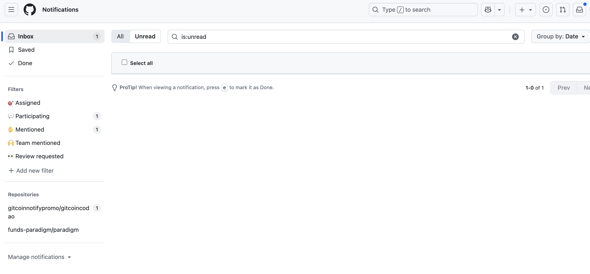

飞舞GitHub连个通知都弄不好😅



```bash
brew install gh
```


```bash
gh api notifications | jq '.[] | {id, title: .subject.title, repo: .repository.full_name}'
```


```bash
gh api --method DELETE notifications/threads/$THREAD_ID #ID换成上一条命令获取的
```


```bash
gh api --method DELETE notifications/threads/$THREAD_ID/subscription #同理
```