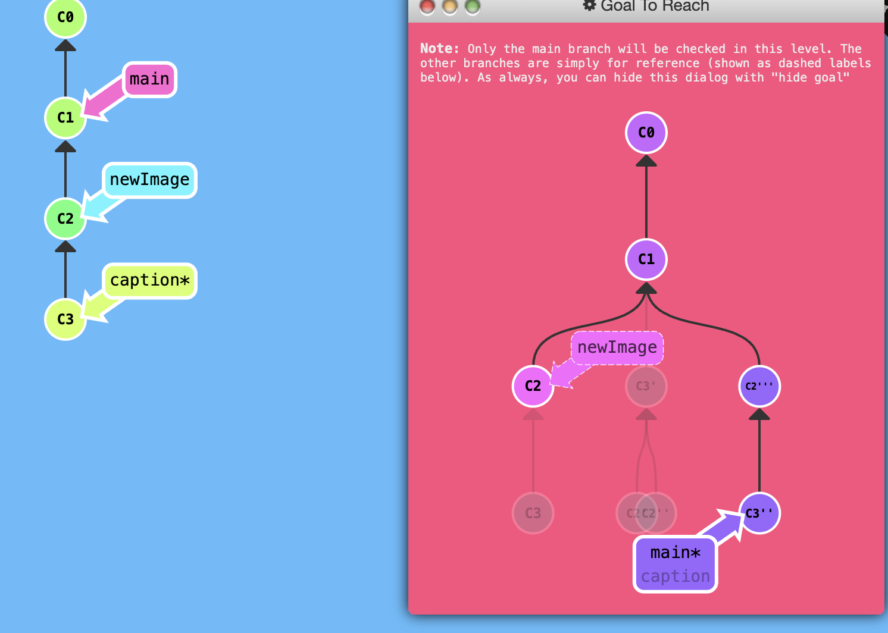

切换提交
这里有一种非常常见的场景。你有一些更改（newImage），还有另一组相关的更改（caption），它们在你的仓库中按顺序堆叠在一起（即一个接一个地排列）。

棘手的地方在于，有时你需要对较早的某个提交进行微小的修改。在这种情况下，设计团队要求我们稍微调整一下 newImage 的尺寸，尽管这个提交已经很久远了！

我们将通过以下步骤来解决这一难题：

1. 使用 `git rebase -i` 重新排列提交顺序，将需要修改的提交移到最上面。
2. 使用 `git commit --amend` 对该提交进行微小修改。
3. 再次使用 `git rebase -i` 将提交顺序恢复为原来的状态。
4. 最后，通过你选择的方法，将主分支（main）指向这个更新后的提交，以完成本关卡。

虽然实现这一目标的方式有很多（我看到你正盯着 `cherry-pick` 看），我们之后会学习更多方法。但目前，让我们专注于这种技术。最后，请特别注意最终的目标状态：由于我们对提交进行了两次移动操作，这两个提交都会被追加一个撇号（'）。而我们修改的那个提交还会额外多一个撇号，因此最终的提交历史结构呈现出带有多个撇号的形态。

话虽如此，我现在可以基于结构和撇号的相对差异来比较不同关卡的结果。只要你的主分支提交树结构一致，并且各提交之间的撇号差异关系保持不变，我就会给予满分。

## 解析

```
git rebase -i HEAD~2
```

**不需要删除**

```
git coommit --amend
```