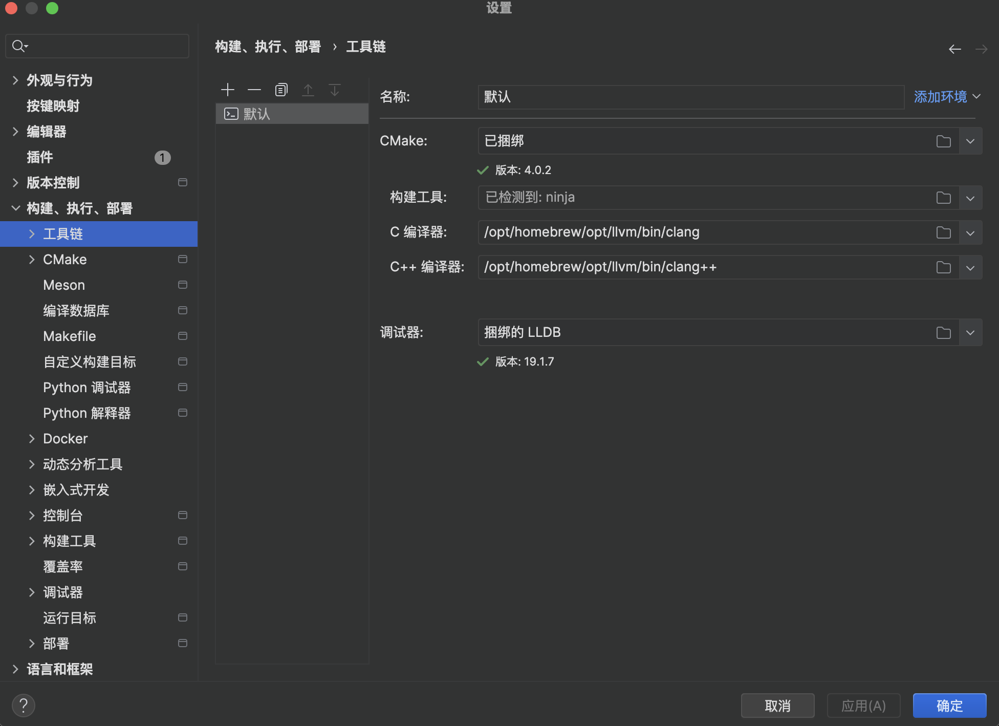
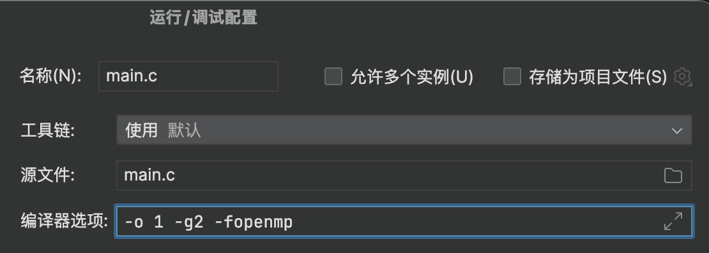

## OpenMP
`brew install libomp`  
OpenMP 被安装在`/usr/local/Cellar`的目录下


## CLion设置
CLion 默认用 Xcode 自带的 Clang，它不支持 OpenMP。  
你必须让 CLion 使用 Homebrew 安装的 Clang。

在终端确认路径：

```
brew install llvm brew --prefix llvm
```

Apple Silicon 下通常是：

```
/opt/homebrew/opt/llvm
```

把它加入 PATH，例如在 `~/.zshrc` 里：

```
export PATH="/opt/homebrew/opt/llvm/bin:$PATH"
export LDFLAGS="-L/opt/homebrew/opt/llvm/lib"
export CPPFLAGS="-I/opt/homebrew/opt/llvm/include"
```

然后在 CLion **Toolchains** 里，把 C Compiler / C++ Compiler 指向：

```
/opt/homebrew/opt/llvm/bin/clang
/opt/homebrew/opt/llvm/bin/clang++
```

这样 CLion 才会用支持 OpenMP 的编译器。



## 链接 OpenMP 库

默认情况下 OpenMP 不会被自动链接

```
-fopenmp
```




## 验证

```c
#include <stdio.h>
#include <omp.h>

int main() {
    #pragma omp parallel
    {
        printf("Hello from thread %d\n", omp_get_thread_num());
    }
    return 0;
}
```