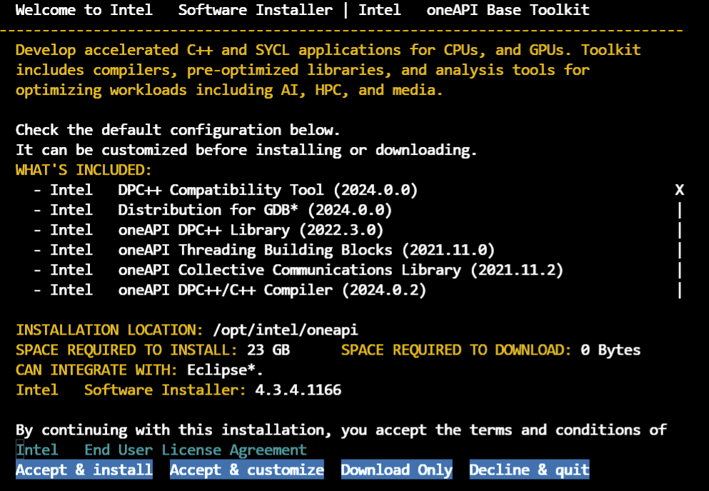
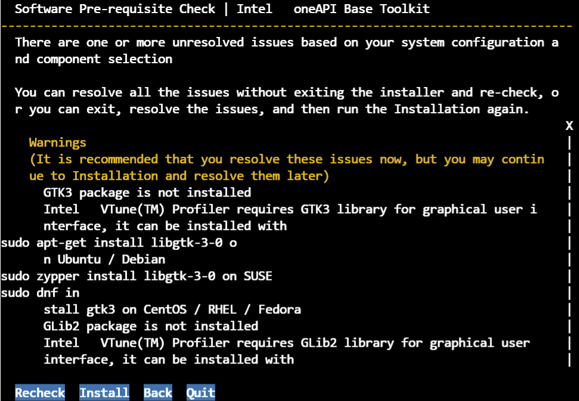
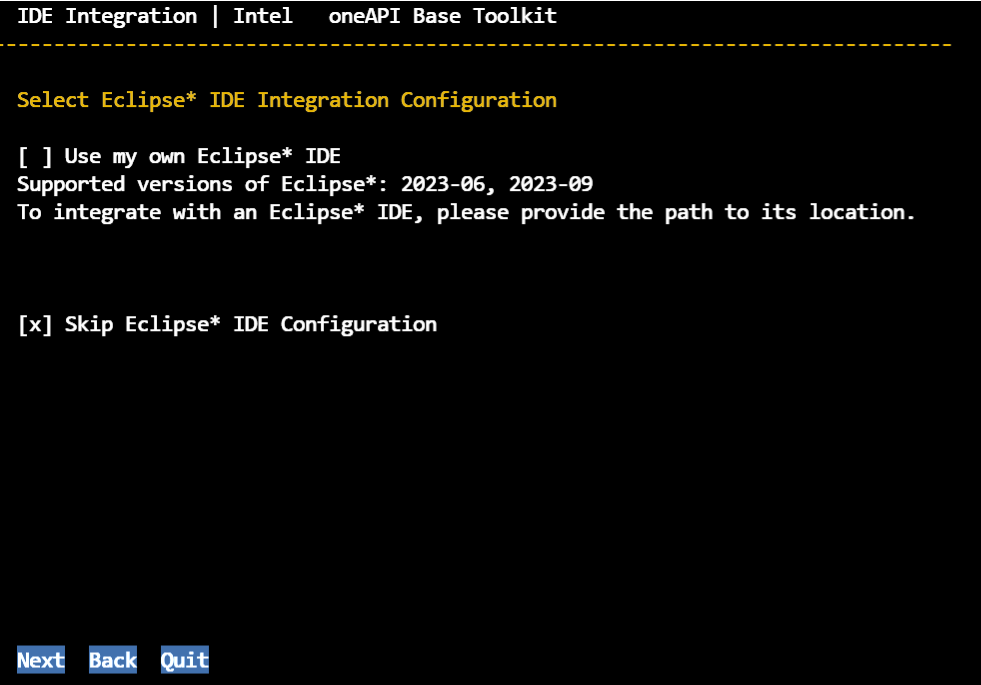
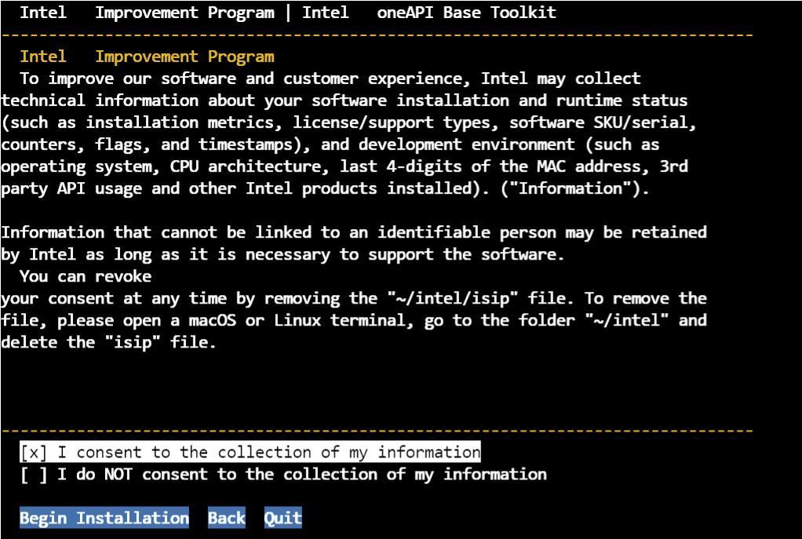
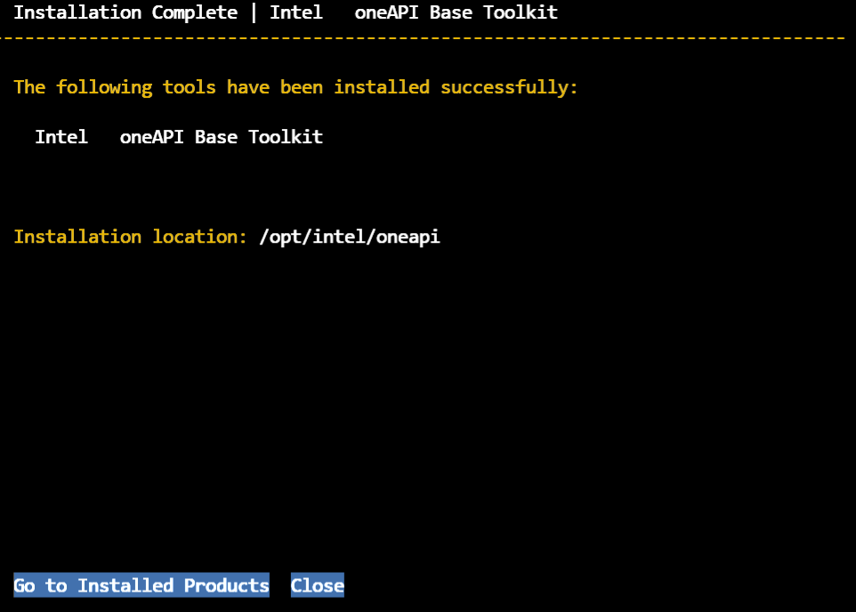
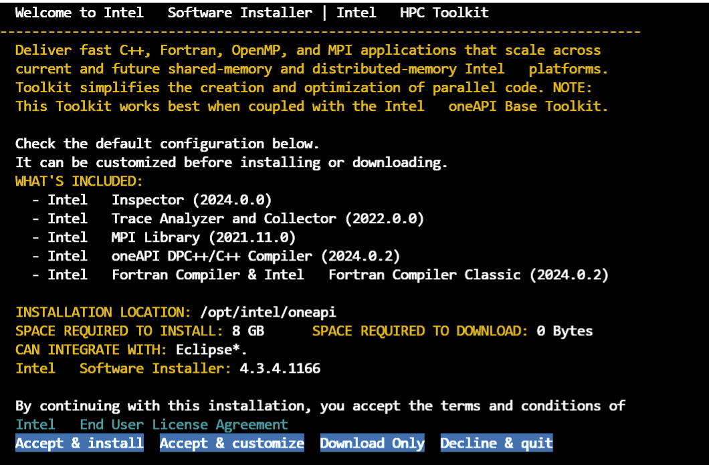
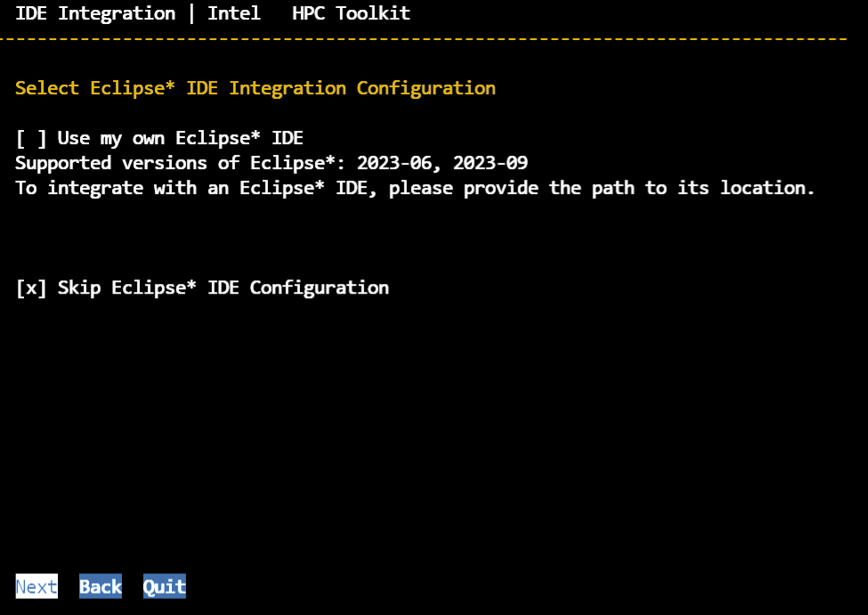
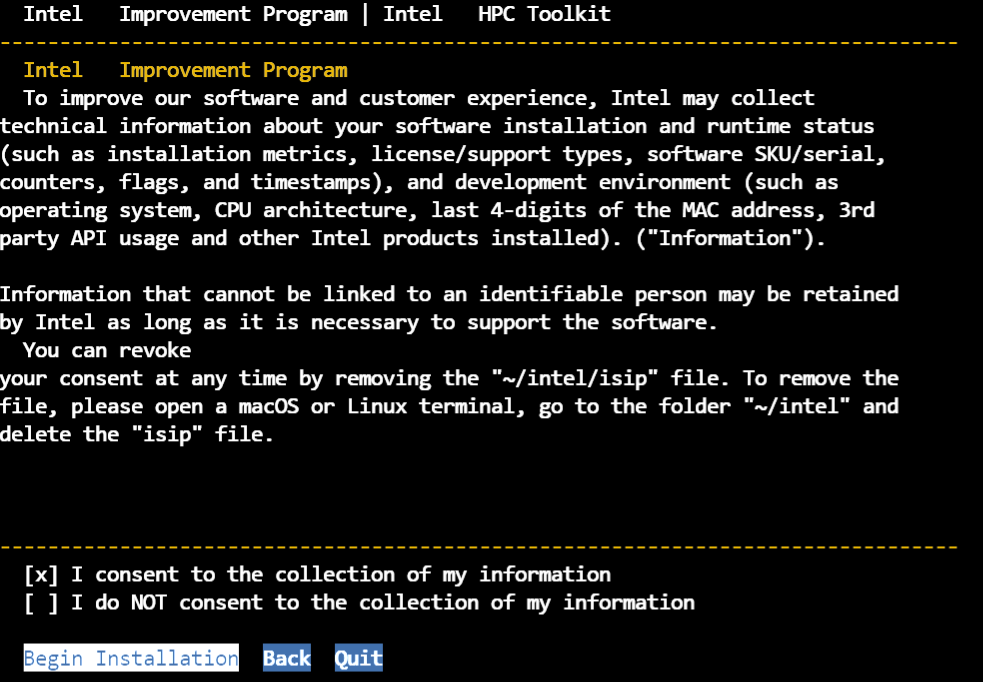
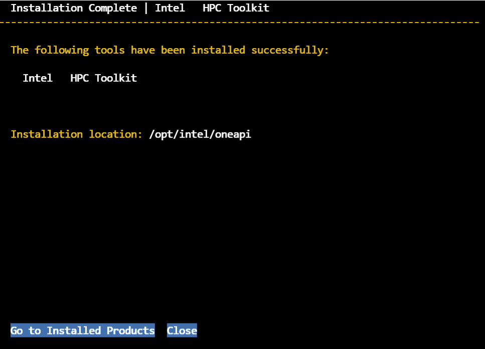

# oneapi

##  Base Toolkit 安装

```
wget https://registrationcenter-download.intel.com/akdlm/IRC_NAS/163da6e4-56eb-4948-aba3-debcec61c064/l_BaseKit_p_2024.0.1.46_offline.sh
chmod +x l_BaseKit_p_2024.0.1.46_offline.sh
sudo ./l_BaseKit_p_2024.0.1.46_offline.sh
```



accept





默认





##  HPC Toolkit 安装

```
wget https://registrationcenter-download.intel.com/akdlm/IRC_NAS/67c08c98-f311-4068-8b85-15d79c4f277a/l_HPCKit_p_2024.0.1.38_offline.sh
chmod +x l_HPCKit_p_2024.0.1.38_offline.sh
sudo ./l_HPCKit_p_2024.0.1.38_offline.sh
```









```
~/modulefiles/intel/oneapi2024.0
```

```
#%Module1.0#####################################################################
##
## modules modulefile
##
proc ModulesHelp { } {
        global version prefix

        puts stderr "\tmodules - loads the modules software & application environment"
        puts stderr "\n\tThis adds $prefix/* to several of the"
        puts stderr "\tenvironment variables."
        puts stderr "\n\tVersion $version\n"
}

module-whatis	"loads intel/oneapi"

# for Tcl script use only
set	version		oneapi
set	prefix		/opt/intel/oneapi

conflict	intel

prepend-path	TBBROOT			${prefix}/tbb/2021.11/env/..
prepend-path	DAALROOT		${prefix}/cdal/2024.0
prepend-path	DPCT_BUNDLE_ROOT	${prefix}/dpcpp-ct/2024.0
prepend-path	INSPECTOR_2023_DIR	${prefix}/inspector/2024.0
prepend-path	ONEAPI_ROOT		${prefix}
prepend-path	PKG_CONFIG_PATH		${prefix}/vtune/2024.0/include/pkgconfig/lib64:${prefix}/tbb/2021.11/env/../lib/pkgconfig:${prefix}/mpi/2021.11/lib/pkgconfig:${prefix}/mkl/2024.0/lib/pkgconfig:${prefix}/ippcp/2021.9/lib/pkgconfig:${prefix}/inspector/2024.0/include/pkgconfig/lib64:${prefix}/dpl/2022.3/lib/pkgconfig:${prefix}/dnnl/2024.0/cpu_dpcpp_gpu_dpcpp/../lib/pkgconfig:${prefix}/cdal/2024.0/lib/pkgconfig:${prefix}/compiler/2024.0/lib/pkgconfig:${prefix}/ccl/2021.11/lib/pkgconfig:${prefix}/advisor/2024.0/include/pkgconfig/lib64:
#prepend-path	PKG_CONFIG_PATH		${prefix}/vtune/2024.0/include/pkgconfig/lib64:${prefix}/tbb/2021.11/env/../lib/pkgconfig:${prefix}/mkl/2024.0/lib/pkgconfig:${prefix}/ippcp/2021.9/lib/pkgconfig:${prefix}/inspector/2024.0/include/pkgconfig/lib64:${prefix}/dpl/2022.3/lib/pkgconfig:${prefix}/dnnl/2024.0/cpu_dpcpp_gpu_dpcpp/../lib/pkgconfig:${prefix}/cdal/2024.0/lib/pkgconfig:${prefix}/compiler/2024.0/lib/pkgconfig:${prefix}/ccl/2021.11/lib/pkgconfig:${prefix}/advisor/2024.0/include/pkgconfig/lib64:
prepend-path	VT_MPI			impi4
prepend-path	ACL_BOARD_VENDOR_PATH	/opt/Intel/OpenCLFPGA/oneAPI/Boards
prepend-path	FPGA_VARS_DIR		${prefix}/compiler/2024.0/lib/oclfpga
prepend-path	CCL_ROOT		${prefix}/ccl/2021.11
prepend-path	VT_ADD_LIBS		"-ldwarf -lelf -lvtunwind -lm -lpthread"
prepend-path	I_MPI_ROOT		${prefix}/mpi/2021.11
prepend-path	FI_PROVIDER_PATH	${prefix}/mpi/2021.11//libfabric/lib/prov:/usr/lib/x86_64-linux-gnu/libfabric
prepend-path	DNNLROOT		${prefix}/dnnl/2024.0/cpu_dpcpp_gpu_dpcpp
prepend-path	DIAGUTIL_PATH		${prefix}/vtune/2024.0/sys_check/vtune_sys_check.py:${prefix}/dpcpp-ct/2024.0/sys_check/sys_check.sh:${prefix}/debugger/2024.0/sys_check/debugger_sys_check.py:${prefix}/compiler/2024.0/sys_check/sys_check.sh:${prefix}/advisor/2024.0/sys_check/advisor_sys_check.py:
prepend-path	CCL_CONFIGURATION	cpu_gpu_dpcpp
prepend-path	DPL_ROOT		${prefix}/dpl/2022.3
prepend-path	MANPATH			${prefix}/mpi/2021.11/man:${prefix}/itac/2022.0/man:${prefix}/debugger/2024.0/documentation/man:${prefix}/compiler/2024.0/documentation/en/man/common:::
#prepend-path	MANPATH			${prefix}/itac/2022.0/man:${prefix}/debugger/2024.0/documentation/man:${prefix}/compiler/2024.0/documentation/en/man/common:::
prepend-path	GDB_INFO		${prefix}/debugger/2024.0/documentation/info/
prepend-path	SETVARS_COMPLETED	1
prepend-path	APM			${prefix}/advisor/2024.0/perfmodels
prepend-path	CMAKE_PREFIX_PATH	${prefix}/tbb/2021.11/env/..:${prefix}/ipp/2021.10/lib/cmake/ipp:${prefix}/ipp/2021.10/lib/cmake/ipp:${prefix}/dnnl/2024.0/cpu_dpcpp_gpu_dpcpp/../lib/cmake:${prefix}/cdal/2024.0:${prefix}/compiler/2024.0/IntelDPCPP:${prefix}/ccl/2021.11/lib/cmake/oneCCL
prepend-path	VTUNE_PROFILER_2023_DIR	${prefix}/vtune/2024.0
prepend-path	CMPLR_ROOT		${prefix}/compiler/2024.0
prepend-path	ADVISOR_2023_DIR	${prefix}/advisor/2024.0
prepend-path	FPGA_VARS_ARGS		""
prepend-path	INFOPATH		${prefix}/debugger/2024.0/gdb/intel64/lib
prepend-path	IPPROOT			${prefix}/ipp/2021.10
prepend-path	IPP_TARGET_ARCH		intel64
prepend-path	PYTHONPATH		${prefix}/advisor/2024.0/pythonapi
prepend-path	VT_ROOT			${prefix}/itac/2022.0
prepend-path	DALROOT			${prefix}/cdal/2024.0
prepend-path	LIBRARY_PATH		${prefix}/tbb/2021.11/env/../lib/intel64/gcc4.8:${prefix}/mpi/2021.11//libfabric/lib:${prefix}/mpi/2021.11//lib/release:${prefix}/mpi/2021.11//lib:${prefix}/mkl/2024.0/lib/intel64:${prefix}/ipp/2021.10/lib/intel64:${prefix}/ippcp/2021.9/lib/intel64:${prefix}/ipp/2021.10/lib/intel64:${prefix}/dnnl/2024.0/cpu_dpcpp_gpu_dpcpp/lib:${prefix}/cdal/2024.0/lib/intel64:${prefix}/compiler/2024.0/compiler/lib/intel64_lin:${prefix}/compiler/2024.0/lib:${prefix}/ccl/2021.11/lib/cpu_gpu_dpcpp
#prepend-path	LIBRARY_PATH		${prefix}/tbb/2021.11/env/../lib/intel64/gcc4.8:${prefix}/mkl/2024.0/lib/intel64:${prefix}/ipp/2021.10/lib/intel64:${prefix}/ippcp/2021.9/lib/intel64:${prefix}/ipp/2021.10/lib/intel64:${prefix}/dnnl/2024.0/cpu_dpcpp_gpu_dpcpp/lib:${prefix}/cdal/2024.0/lib/intel64:${prefix}/compiler/2024.0/compiler/lib/intel64_lin:${prefix}/compiler/2024.0/lib:${prefix}/ccl/2021.11/lib/cpu_gpu_dpcpp
prepend-path	DAL_MAJOR_BINARY	1
prepend-path	IPPCRYPTOROOT		${prefix}/ippcp/2021.9
prepend-path	IPPCP_TARGET_ARCH	intel64
prepend-path	OCL_ICD_FILENAMES	libintelocl_emu.so:libalteracl.so:${prefix}/compiler/2024.0/lib/x64/libintelocl.so
prepend-path	CLASSPATH		${prefix}/mpi/2021.11//lib/mpi.jar:${prefix}/cdal/2024.0/lib/onedal.jar
#prepend-path	CLASSPATH		${prefix}/cdal/2024.0/lib/onedal.jar
prepend-path	INTELFPGAOCLSDKROOT	${prefix}/compiler/2024.0/lib/oclfpga
prepend-path	LD_LIBRARY_PATH		${prefix}/tbb/2021.11/env/../lib/intel64/gcc4.8:${prefix}/mpi/2021.11//libfabric/lib:${prefix}/mpi/2021.11//lib/release:${prefix}/mpi/2021.11//lib:${prefix}/mkl/2024.0/lib/intel64:${prefix}/itac/2022.0/slib:${prefix}/ipp/2021.10/lib/intel64:${prefix}/ippcp/2021.9/lib/intel64:${prefix}/ipp/2021.10/lib/intel64:${prefix}/dnnl/2024.0/cpu_dpcpp_gpu_dpcpp/lib:${prefix}/debugger/2024.0/gdb/intel64/lib:${prefix}/debugger/2024.0/libipt/intel64/lib:${prefix}/debugger/2024.0/dep/lib:${prefix}/cdal/2024.0/lib/intel64:${prefix}/compiler/2024.0/lib:${prefix}/compiler/2024.0/lib/x64:${prefix}/compiler/2024.0/lib/oclfpga/host/linux64/lib:${prefix}/compiler/2024.0/compiler/lib/intel64_lin:${prefix}/ccl/2021.11/lib/cpu_gpu_dpcpp:${prefix}/compiler/2024.0/compiler/lib/intel64_lin:${prefix}/ccl/2021.11/lib/cpu_gpu_dpcpp
#prepend-path	LD_LIBRARY_PATH		${prefix}/tbb/2021.11/env/../lib/intel64/gcc4.8:${prefix}/mkl/2024.0/lib/intel64:${prefix}/itac/2022.0/slib:${prefix}/ipp/2021.10/lib/intel64:${prefix}/ippcp/2021.9/lib/intel64:${prefix}/ipp/2021.10/lib/intel64:${prefix}/dnnl/2024.0/cpu_dpcpp_gpu_dpcpp/lib:${prefix}/debugger/2024.0/gdb/intel64/lib:${prefix}/debugger/2024.0/libipt/intel64/lib:${prefix}/debugger/2024.0/dep/lib:${prefix}/cdal/2024.0/lib/intel64:${prefix}/compiler/2024.0/lib:${prefix}/compiler/2024.0/lib/x64:${prefix}/compiler/2024.0/lib/oclfpga/host/linux64/lib:${prefix}/compiler/2024.0/compiler/lib/intel64_lin:${prefix}/ccl/2021.11/lib/cpu_gpu_dpcpp:${prefix}/compiler/2024.0/compiler/lib/intel64_lin:${prefix}/ccl/2021.11/lib/cpu_gpu_dpcpp
prepend-path	VT_LIB_DIR		${prefix}/itac/2022.0/lib
prepend-path	VTUNE_PROFILER_DIR	${prefix}/vtune/2024.0
prepend-path	VT_SLIB_DIR		${prefix}/itac/2022.0/slib
prepend-path	MKLROOT			${prefix}/mkl/2024.0
prepend-path	DAL_MINOR_BINARY	1
prepend-path	NLSPATH			${prefix}/mkl/2024.0/lib/intel64/locale/%l_%t/%N:${prefix}/compiler/2024.0/compiler/lib/intel64_lin/locale/%l_%t/%N
prepend-path	PATH			${prefix}/vtune/2024.0/bin64:${prefix}/mpi/2021.11//libfabric/bin:${prefix}/mpi/2021.11//bin:${prefix}/mkl/2024.0/bin/intel64:${prefix}/itac/2022.0/bin:${prefix}/inspector/2024.0/bin64:${prefix}/dpcpp-ct/2024.0/bin:${prefix}/dev-utilities/2024.0/bin:${prefix}/debugger/2024.0/gdb/intel64/bin:${prefix}/compiler/2024.0/lib/oclfpga/bin:${prefix}/compiler/2024.0/bin/intel64:${prefix}/compiler/2024.0/bin:${prefix}/advisor/2024.0/bin64
#prepend-path	PATH			${prefix}/vtune/2024.0/bin64:${prefix}/mkl/2024.0/bin/intel64:${prefix}/itac/2022.0/bin:${prefix}/inspector/2024.0/bin64:${prefix}/dpcpp-ct/2024.0/bin:${prefix}/dev-utilities/2024.0/bin:${prefix}/debugger/2024.0/gdb/intel64/bin:${prefix}/compiler/2024.0/lib/oclfpga/bin:${prefix}/compiler/2024.0/bin/intel64:${prefix}/compiler/2024.0/bin:${prefix}/advisor/2024.0/bin64
prepend-path	INTEL_PYTHONHOME	${prefix}/debugger/2024.0/dep
prepend-path	INTEL_LICENSE_FILE	/opt/intel/licenses:/root/intel/licenses
prepend-path	CPATH			${prefix}/tbb/2021.11/env/../include:${prefix}/mpi/2021.11//include:${prefix}/mkl/2024.0/include:${prefix}/ipp/2021.10/include:${prefix}/ippcp/2021.9/include:${prefix}/ipp/2021.10/include:${prefix}/dpl/2022.3/linux/include:${prefix}/dpcpp-ct/2024.0/include:${prefix}/dnnl/2024.0/cpu_dpcpp_gpu_dpcpp/include:${prefix}/dev-utilities/2024.0/include:${prefix}/cdal/2024.0/include:${prefix}/compiler/2024.0/lib/oclfpga/include:${prefix}/ccl/2021.11/include/cpu_gpu_dpcpp
#prepend-path	CPATH			${prefix}/tbb/2021.11/env/../include:${prefix}/mkl/2024.0/include:${prefix}/ipp/2021.10/include:${prefix}/ippcp/2021.9/include:${prefix}/ipp/2021.10/include:${prefix}/dpl/2022.3/linux/include:${prefix}/dpcpp-ct/2024.0/include:${prefix}/dnnl/2024.0/cpu_dpcpp_gpu_dpcpp/include:${prefix}/dev-utilities/2024.0/include:${prefix}/cdal/2024.0/include:${prefix}/compiler/2024.0/lib/oclfpga/include:${prefix}/ccl/2021.11/include/cpu_gpu_dpcpp
```

```
mkdir -p ~/modulefiles
mkdir -p ~/modulefiles/intel
```

```
apt update && apt install -y environment-modules
```

```
echo 'source /usr/share/modules/init/bash' >> ~/.bashrc
echo 'export MODULEPATH="$HOME/modulefiles:$MODULEPATH"' >> ~/.bashrc
source ~/.bashrc
module --version
module avail
```

```
module load ~/modulefiles/intel/oneapi2024.0
icx -v
mpirun --version
echo $MKLROOT
```

---

