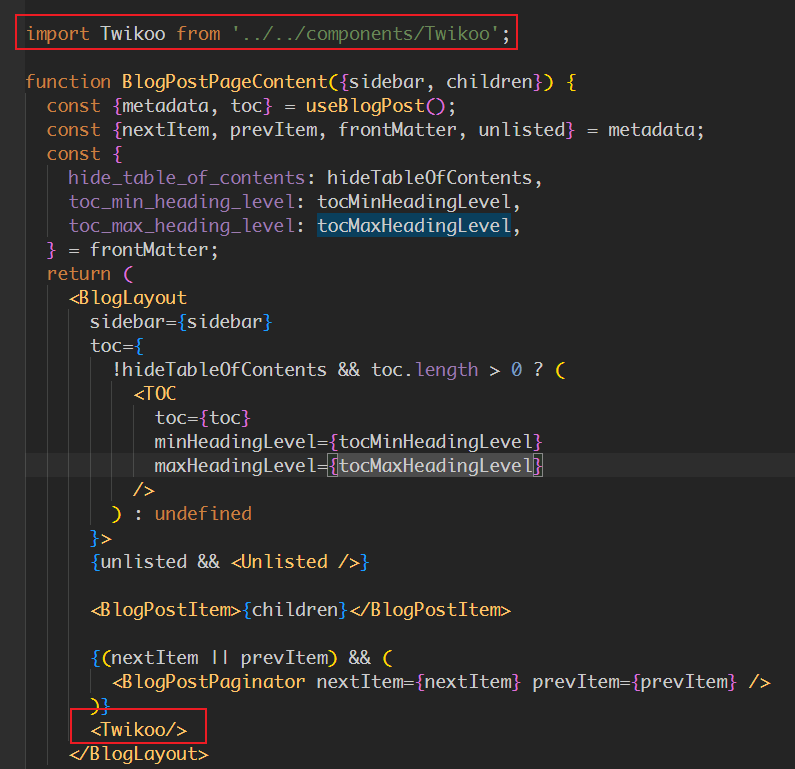

# Docusaurus配置twikoo评论

## twikoo

<!-- truncate -->

```
version: '3'
services:
  twikoo:
    image: imaegoo/twikoo
    container_name: twikoo
    restart: unless-stopped
    ports:
      - 8080:8080
    environment:
      TWIKOO_THROTTLE: 1000
    volumes:
      - ./data:/app/data
```

如果要重置密码删除编辑 `data/db.json.1`，编辑配置，删除 config.ADMIN_PASS 配置项，然后重启**docker**前往 Twikoo 管理面板重新设置密码。


## Docusaurus修改

### 使用swizzle创建页面/博客组件

```bash
# 页面
npm run swizzle @docusaurus/theme-classic DocItem/Layout -- --eject  
# 博客
npm run swizzle @docusaurus/theme-classic BlogPostPage -- --eject
```


添加缺少的依赖

```
npm install @docusaurus/theme-common @docusaurus/plugin-content-blog @docusaurus/plugin-content-docs
```


### 新增Twikoo组件

创建`src/components/Twikoo/index.js`文件，添加以下代码

```javascript
import React, { useEffect } from 'react';

export default function Twikoo() {
    useEffect(() => {
        // 通过 CDN 引入 twikoo js 文件
        const cdnScript = document.createElement('script');

        cdnScript.src = 'https://www.domain.test/twikoo.min.js';
        cdnScript.async = true;

        const loadSecondScript = () => {
            // 执行 twikoo.init() 函数
            const initScript = document.createElement('script');
            initScript.innerHTML = `
            twikoo.init({
              envId: "https://www.domain.test/",
              el: '#twikoo-comment'
            });
          `;
            initScript.id = 'twikoo-init-q7YVHb2v81UmUvxIG4sZ3'; // 添加唯一的 ID
            document.body.appendChild(initScript);
        };

        // 在 twikoo js 文件加载完成后，再加载执行 twikoo.init() 函数的 js 文件
        cdnScript.addEventListener('load', loadSecondScript);
        document.body.appendChild(cdnScript);

        return () => {
            if (loadSecondScript) {
                cdnScript.removeEventListener('load', loadSecondScript);
            }
            if (cdnScript) {
                document.body.removeChild(cdnScript);
            }
            const secondScript = document.querySelector('#twikoo-init-id');
            if (secondScript) {
                document.body.removeChild(secondScript);
            }
        };
    }, []);

    return <div id="twikoo-comment"></div>;
}
```

### 本地托管

放入`static\js\twikoo.min.js`目录


### 引入评论组件



`src\theme\BlogPostPage\index.tsx`

```
import React, {type ReactNode} from 'react';
import clsx from 'clsx';
import {HtmlClassNameProvider, ThemeClassNames} from '@docusaurus/theme-common';
import {
  BlogPostProvider,
  useBlogPost,
} from '@docusaurus/plugin-content-blog/client';
import BlogLayout from '@theme/BlogLayout';
import BlogPostItem from '@theme/BlogPostItem';
import BlogPostPaginator from '@theme/BlogPostPaginator';
import BlogPostPageMetadata from '@theme/BlogPostPage/Metadata';
import BlogPostPageStructuredData from '@theme/BlogPostPage/StructuredData';
import TOC from '@theme/TOC';
import ContentVisibility from '@theme/ContentVisibility';
import type {Props} from '@theme/BlogPostPage';
import type {BlogSidebar} from '@docusaurus/plugin-content-blog';

import Twikoo from '../../components/Twikoo';

function BlogPostPageContent({
  sidebar,
  children,
}: {
  sidebar: BlogSidebar;
  children: ReactNode;
}): ReactNode {
  const {metadata, toc} = useBlogPost();
  const {nextItem, prevItem, frontMatter} = metadata;
  const {
    hide_table_of_contents: hideTableOfContents,
    toc_min_heading_level: tocMinHeadingLevel,
    toc_max_heading_level: tocMaxHeadingLevel,
  } = frontMatter;
  return (
    <BlogLayout
      sidebar={sidebar}
      toc={
        !hideTableOfContents && toc.length > 0 ? (
          <TOC
            toc={toc}
            minHeadingLevel={tocMinHeadingLevel}
            maxHeadingLevel={tocMaxHeadingLevel}
          />
        ) : undefined
      }>
      <ContentVisibility metadata={metadata} />

      <BlogPostItem>{children}</BlogPostItem>

      {(nextItem || prevItem) && (
        <BlogPostPaginator nextItem={nextItem} prevItem={prevItem} />
      )}
      <Twikoo/>
    </BlogLayout>
  );
}

export default function BlogPostPage(props: Props): ReactNode {
  const BlogPostContent = props.content;
  return (
    <BlogPostProvider content={props.content} isBlogPostPage>
      <HtmlClassNameProvider
        className={clsx(
          ThemeClassNames.wrapper.blogPages,
          ThemeClassNames.page.blogPostPage,
        )}>
        <BlogPostPageMetadata />
        <BlogPostPageStructuredData />
        <BlogPostPageContent sidebar={props.sidebar}>
          <BlogPostContent />
        </BlogPostPageContent>
      </HtmlClassNameProvider>
    </BlogPostProvider>
  );
}
```

---


`src\theme\DocItem\Layout\index.tsx`

```
import React, {type ReactNode} from 'react';
import clsx from 'clsx';
import {useWindowSize} from '@docusaurus/theme-common';
import {useDoc} from '@docusaurus/plugin-content-docs/client';
import DocItemPaginator from '@theme/DocItem/Paginator';
import DocVersionBanner from '@theme/DocVersionBanner';
import DocVersionBadge from '@theme/DocVersionBadge';
import DocItemFooter from '@theme/DocItem/Footer';
import DocItemTOCMobile from '@theme/DocItem/TOC/Mobile';
import DocItemTOCDesktop from '@theme/DocItem/TOC/Desktop';
import DocItemContent from '@theme/DocItem/Content';
import DocBreadcrumbs from '@theme/DocBreadcrumbs';
import ContentVisibility from '@theme/ContentVisibility';
import type {Props} from '@theme/DocItem/Layout';

import styles from './styles.module.css';

import Twikoo from '../../../components/Twikoo';

/**
 * Decide if the toc should be rendered, on mobile or desktop viewports
 */
function useDocTOC() {
  const {frontMatter, toc} = useDoc();
  const windowSize = useWindowSize();

  const hidden = frontMatter.hide_table_of_contents;
  const canRender = !hidden && toc.length > 0;

  const mobile = canRender ? <DocItemTOCMobile /> : undefined;

  const desktop =
    canRender && (windowSize === 'desktop' || windowSize === 'ssr') ? (
      <DocItemTOCDesktop />
    ) : undefined;

  return {
    hidden,
    mobile,
    desktop,
  };
}

export default function DocItemLayout({children}: Props): ReactNode {
  const docTOC = useDocTOC();
  const {metadata} = useDoc();
  return (
    <div className="row">
      <div className={clsx('col', !docTOC.hidden && styles.docItemCol)}>
        <ContentVisibility metadata={metadata} />
        <DocVersionBanner />
        <div className={styles.docItemContainer}>
          <article>
            <DocBreadcrumbs />
            <DocVersionBadge />
            {docTOC.mobile}
            <DocItemContent>{children}</DocItemContent>
            <DocItemFooter />
          </article>
          <DocItemPaginator />
        </div>
        <Twikoo/>
      </div>
      {docTOC.desktop && <div className="col col--3">{docTOC.desktop}</div>}
    </div>
  );
}
```

