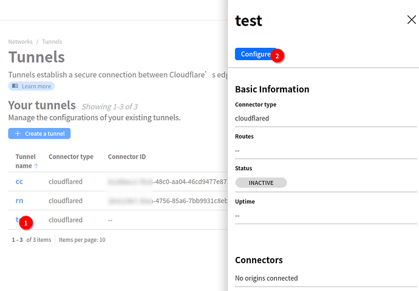
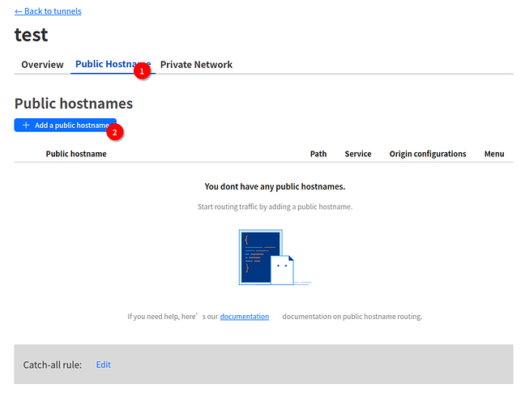

# Cloudflare Tunnel

## Tunnel安装

我们获得了一个类似于以下的docker命令：

```bash
docker run cloudflare/cloudflared:latest tunnel --no-autoupdate run --token eyJhIjoiMjQ4MmIzM2Y3Njc3YWE5OWE5NThiZjcxNTdkMzU1ZmYiLCJ0IjoiOTFmYzdhOWQtYThiZC00MmY2LThlOTEtMDMwYWZjNDA3MjRmIiwicyI6IlkyRm1OamM0TXpZdE1qVTBaaTAwTTJZNUxUZ3hOV1V0TXpOaE9XVmpNV1F4Wm1ZeCJ9
```

先别着急用，需要添加几个docker参数，**注意network需要设置为host**。讲一下我之前遇到的坑，docker启动容器默认会使用桥接模式（bridge），在后面域名绑定时，`127.0.0.1:port`是cloudflared这个容器内部的地址，如果你的项目也是使用docker的桥接模式启动的，那么就无法找到对应的服务。当然也可以用`172.17.0.1:port`这个地址进行绑定，但还是建议让cloudflared容器以host模式启动。

docker启动命令

```css
docker run -d --restart always --network host --name cloudflared cloudflare/cloudflared tunnel --no-autoupdate run --token eyJhIjoiMjQ4MmIzM2Y3Njc3YWE5OWE5NThiZjcxNTdkMzU1ZmYiLCJ0IjoiOTFmYzdhOWQtYThiZC00MmY2LThlOTEtMDMwYWZjNDA3MjRmIiwicyI6IlkyRm1OamM0TXpZdE1qVTBaaTAwTTJZNUxUZ3hOV1V0TXpOaE9XVmpNV1F4Wm1ZeCJ9
```

or

docker-compose配置

```yaml
version: '3'

services:
  cloudflared:
    image: cloudflare/cloudflared
    container_name: cloudflared
    restart: always
    network_mode: host
    command: tunnel --no-autoupdate run --token eyJhIjoiMjQ4MmIzM2Y3Njc3YWE5OWE5NThiZjcxNTdkMzU1ZmYiLCJ0IjoiOTFmYzdhOWQtYThiZC00MmY2LThlOTEtMDMwYWZjNDA3MjRmIiwicyI6IlkyRm1OamM0TXpZdE1qVTBaaTAwTTJZNUxUZ3hOV1V0TXpOaE9XVmpNV1F4Wm1ZeCJ9
```

### 配置域名和部署项目的绑定

点击前面创建的隧道`Configure`



添加`Public Hostname`



配置域名与服务器上的项目端口

比如ssh写localhost即可，不需要端口


---


## SSH

### Windows

新建一个tunnel

在Windows安装软件

```
C:\Users\yourusername\.ssh\config
```

```
Host 名称
    HostName SSH域名
    ProxyCommand "C:\Program Files (x86)\cloudflared\cloudflared.exe" access ssh --hostname %h
    User root
```

